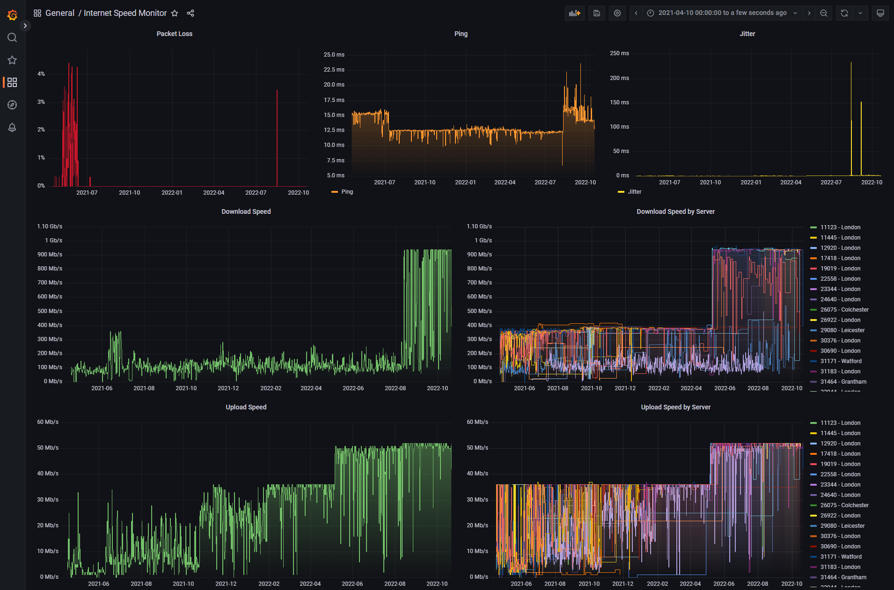
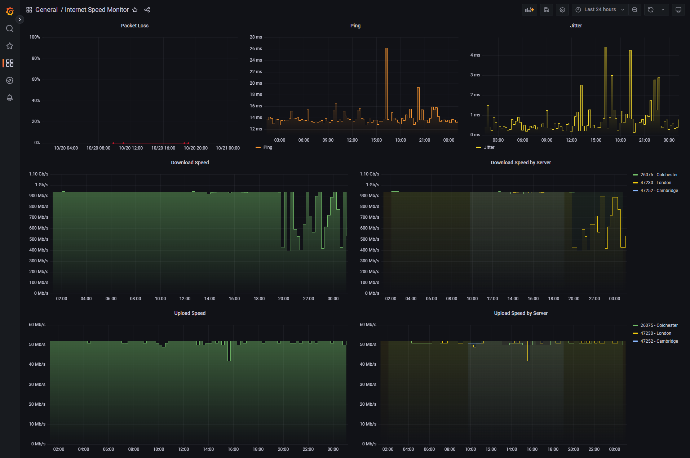

# Speed Monitor Pi

Ansible playbook to provisions a Raspberry Pi 4 for the purpose of monitoring internet speed.

- Tested with Raspberry Pi OS Lite (64-bit) on a Raspberry Pi 4 Model B.
- Using OS version: `2022-09-22-raspios-bullseye-arm64-lite.img.xz`



### Requirements
- [Raspberry Pi](https://www.raspberrypi.org/) 3 Model B+ or 4 Model B (Gigabit capable)
- [Docker][docker] >= v20.10.17
- [GNU Make][make] >= 4.3

### Services Installed
- [InfluxDB](https://portal.influxdata.com/downloads/) v2.4.0
- [Grafana](https://grafana.com/docs/grafana/latest/setup-grafana/installation/) v9.2.0
- Cron job for running `speedtest.py` script
    - [Speedtest CLI](https://www.speedtest.net/apps/cli) v1.2.0
    - [influxdb-client-python](https://github.com/influxdata/influxdb-client-python) v1.33.0

### Setup

1. Install [Docker](https://docs.docker.com/get-docker/)

2. Install GNU Make (*if your OS doesn't provide it by default*)

3. Generate a SSH key to access the Raspberry Pi with.

```shell
$ ssh-keygen
```

4. Use the [Raspberry Pi Imager](https://www.raspberrypi.com/software/) to install Raspberry Pi OS Lite (64-bit) to your SD card.

    

5. Ensure you have `Enable SSH` and `Allow public-key authentication only` options set with your SSH key's public key.

    

6. Install the SD card into your Pi.

7. Connect your Pi to the same LAN as your PC.

8. Run the Ansible playbook to provision your Pi.

    You can specify any of the following parameters to customize the installation.

```shell
# You can specify any of the following parameters to customize the installation.

# Defaults:

# HOST=raspberrypi.local  [Address of the Raspberry Pi]
# SSH_USER=pi             [SSH user]
# SSH_KEY=~/.ssh/id_rsa   [Location of the SSH private key]
# CRON='*/30 * * * *'     [Speedtest interval (Every 30 minutes)]

$ make [HOST='...'] [SSH_USER='...'] [SSH_KEY='...'] [CRON='...']
```

9. Access your **Internet Speed Monitor** Grafana dashboard here, with `admin:admin`.

    - http://raspberrypi.local:3000/d/internet-speed-monitor/internet-speed-monitor?orgId=1

10. You should see new data points every 30 minutes (by default).

    

[rpi]: https://www.raspberrypi.org/
[docker]: https://docs.docker.com/get-docker/
[make]: https://www.gnu.org/software/make/
